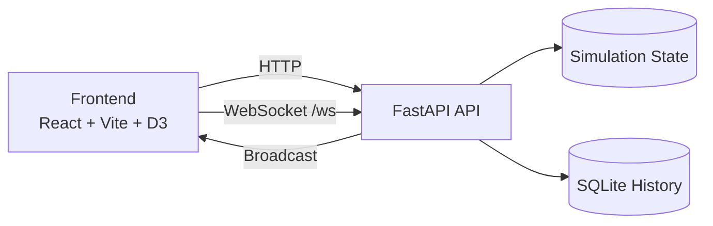

<h1 align="center">SIEGE</h1>
<p align="center">
  Real-time cyber attack and defense simulation platform built with FastAPI, WebSockets, React, and D3.
</p>

<p align="center">
  
  
  
  
  
</p>

---

## Overview

SIEGE is a cinematic cyber range for learning and demos. You can launch simulated attacks, toggle defense controls, and monitor the impact in real time through an animated dashboard, terminal stream, and analytics panels.

## Current Capabilities

- Live attack simulation with WebSocket event streaming
- Attack modules: Port Scan, Brute Force, SQL Injection, DDoS, and Attack Chain
- Defense controls: Firewall and IDS toggles
- Session analytics with score timeline and event history
- PDF reporting with executive summary, risk trend analysis, detailed timeline, and prioritized recommendations
- Backend persistence for recent history events (SQLite)
- Optional API key protection for control-plane endpoints
- Dockerized local deployment
- CI checks for backend tests and frontend lint/build

## Attack Modules

| Attack | Target | Behavior | Defense Response |
|---|---|---|---|
| Port Scan | All nodes | Scans common service ports with live open/closed results | Firewall blocks after threshold; IDS low-severity alert |
| Brute Force | Admin Panel | Iterates password wordlist attempts | Firewall blocks attempts; IDS high-severity alert |
| SQL Injection | Database | Replays payload chain and simulated exfiltration | Firewall blocks attempts; IDS critical alert |
| DDoS | Web Server | Multi-wave traffic escalation | Firewall mitigates and prevents crash |
| Attack Chain | Multi-stage | Runs all attacks in sequence | Defense outcomes per stage |

## Architecture



## API Reference

| Method | Endpoint | Purpose |
|---|---|---|
| GET | /health | Service liveness check |
| GET | /network | Returns nodes and links |
| POST | /attack/port-scan | Start port scan simulation |
| POST | /attack/brute-force | Start brute force simulation |
| POST | /attack/sql-injection | Start SQL injection simulation |
| POST | /attack/ddos | Start DDoS simulation |
| POST | /attack/chain | Start chained scenario |
| POST | /defense/firewall/toggle | Toggle firewall |
| POST | /defense/ids/toggle | Toggle IDS |
| GET | /history/events?limit=100 | Fetch recent persisted events |
| WS | /ws | Real-time event stream |

## Security and Control Plane

By default, local development is open for convenience. You can protect control endpoints (attack and defense toggles) with API key auth.

Set these environment variables:

```env
SIEGE_REQUIRE_API_KEY=true
SIEGE_API_KEY=your-secret-key
VITE_API_KEY=your-secret-key
```

When enabled, requests must include the x-api-key header.

## Quick Start

### Option A (Windows one-click)

```bat
start_siege.bat
```

### Option B (manual)

Backend:

```powershell
cd backend
py -m pip install -r requirements.txt
py main.py
```

Frontend:

```powershell
cd frontend
npm install
npm run dev
```

Open:

- Frontend: http://localhost:5173
- Backend: http://localhost:8000

### Option C (Docker)

```powershell
docker compose up --build
```

## Testing and CI

Backend tests:

```powershell
cd backend
py -m pip install -r requirements.txt -r requirements-dev.txt
pytest
```

Frontend checks:

```powershell
cd frontend
npm ci
npm run lint
npm run build
```

CI workflow runs on push and pull request:

- .github/workflows/ci.yml

## Project Layout

```text
Seige/
  backend/
    main.py
    requirements.txt
    requirements-dev.txt
    pytest.ini
    siege/
      config.py
      connection_manager.py
      persistence.py
      security.py
      simulations.py
      state.py
    tests/
      test_api.py
  frontend/
    src/
      App.jsx
      components/
      utils/reportGenerator.js
    package.json
  docker-compose.yml
  start_siege.bat
```

## Tech Stack

- Backend: FastAPI, Uvicorn, asyncio, WebSocket
- Frontend: React, Vite, D3, Framer Motion, GSAP, Recharts, Three.js
- Reporting: jsPDF, jspdf-autotable
- Persistence: SQLite
- DevOps: Docker, GitHub Actions CI

## Safety Notice

SIEGE is an educational simulator with synthetic data and scripted attack logic. It is not an endpoint protection product or a production IDS.

## Contributing

1. Fork the repository
2. Create a feature branch
3. Run tests and build checks
4. Open a pull request

## Author

Built by Gokul A.
